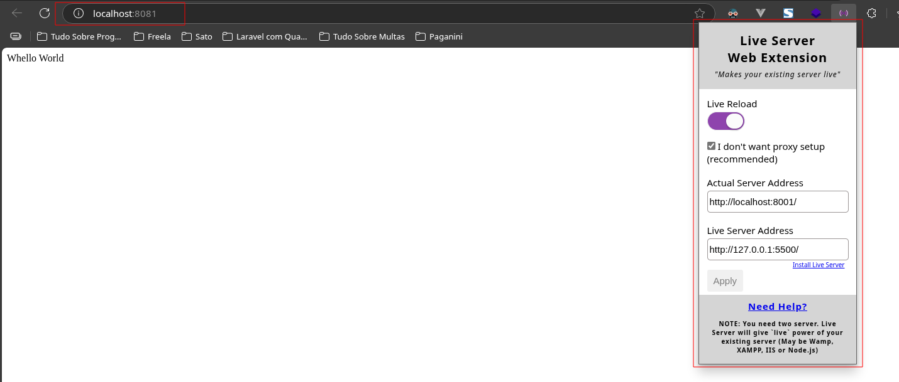
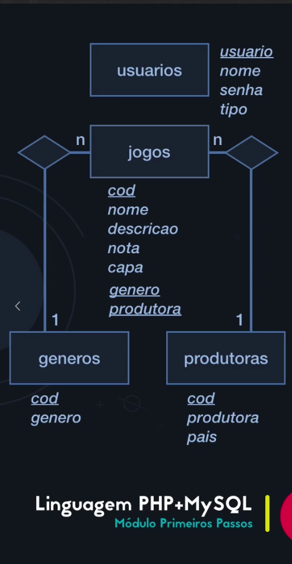

# PHP Curso com MYSQL

A PHP Project

<!-- ## Install the dependencies

```bash
composer install
``` -->

### Create file .env based in .env.example

## Start the app in development mode (hot-code reloading, error reporting, etc.)

```bash
php -S localhost:8001 -t public/
```

## In Live  Server Extension

 

## SGBD use in this project is PostgreSQL with database bd_games.
### Scripts for create database and tables are in assets/querys_db_and_table_bd_games.sql

## Diagram Database


